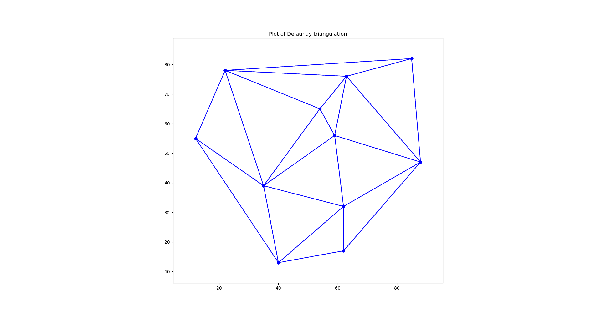

# Delaunay
A simple Delaunay mesh generator based on the Bowyer-Watson algorithm. I have based my code on the pseudocode present in the Wikipedia page. I have viewed other people's code and I believe this code is simpler and easier to understand the algorithm. This is an incremental algorithm and it is slower than the Divide and conquer method available.

# Example image for the code

# Future work
I am planning to add a Laplacian smoothing algorithm 
